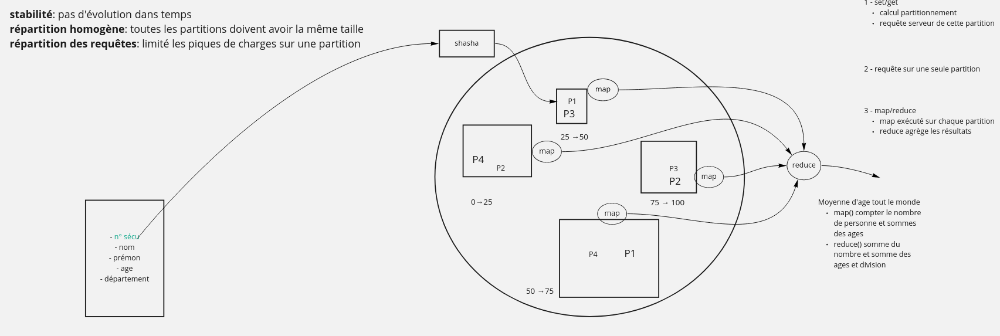
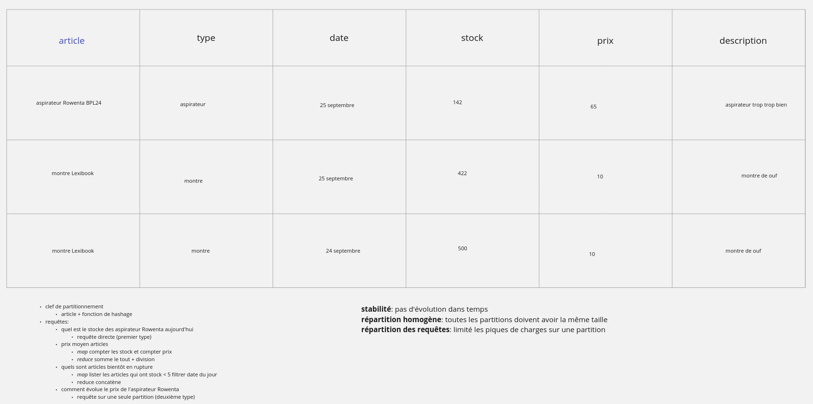

# NoSQL

## Problématique

Historiquement on utilise les SGBDR qui ont les propriétés ACID :
- *Atomicité* : on peut effectuer des actions en mode « tout ou rien ». C'est les transactions : si une transaction échoue, on _rollback_ ce qui avait déjà était modifié.
- *Cohérence* : l'état de la base de données est cohérent. Quelque soit la manière d'effectuer une requête à un instant donné le résultat sera identique.
- *Isolation* : chaque requête s'exécute comme si elle était seule sur le système. C'est aussi matérialisé par les transactions, mais aussi les niveaux d'isolation.
- *Durabilité* : après commit la données est stockée sur disque

Ces propriété posent des problèmes de montée en charge. En effet elles demandent à la fois que l'état complet des données soit maitrisé au moment de l'exécution d'une requête, et en plus elles demandent de sérialiser les requêtes pour garantir un état cohérent quelque soit le point de la base de données que l'on regarde. C'est problématique quand cet état ne peux plus entrer dans la mémoire vive d'un serveur. Dis autrement :

- il est impossible de garantir l'état global si les données impactée par une requête ne rentrent plus dans la mémoire du serveur qui exécute la requête ;
- il est impossible d'effectuer des écritures parallèles donc d'avoir plusieurs serveurs en écritures.

Google est le premier a avoir à la fois rencontré le problème, investi pour le contourner et publié ses travaux. Leurs objectifs sont simples. Ils ne peuvent plus faire grossir leurs serveurs de bases de données, ils ne veulent pas investir dans des mainframes, mais veulent utiliser du _commodity hardware_.

## Partitionnement

La solution trouvée par Google est simple : « diviser pour mieux régner ». On va séparer les données en partition. Un serveur physique pourra être responsable d'une ou plusieurs partition, mais les partitions restent de taille acceptable.

Pour une donnée que l'on souhaite stocker (l'équivalent d'une ligne de SGBDR), on va utiliser une clef de partitionnement. Cette dernière indiquera la partition où doit être stockée la donnée. Cette clef de partitionnement doit avoir 2 propriétés fondamentales :
- stabilité : la partition ne doit pas changer au cours du temps pour une même données. En effet il faut pouvoir retrouver la partition de l'ancienne version de la données si elle était présente.
- répartition homogène : il est important que la répartition entre les différentes partitions soient homogènes.

Chaque partition est indépendante. Il ne faut pas qu'une règle de gestion s'applique à un ensemble de partitions.

Le comportement que l'on cherche à maximiser :
- lors des lectures → requêter une seule partition
- lors des écritures → chaque écriture s'exécute sur une partition différentes pour utiliser tous les serveurs de notre base de données

### Théorème CAP

## Map/Reduce

Lorsque l'on utilise du partitionnement il n'y a pas de difficulté à faire les calculs que l'on souhaite tant que l'on reste au sein d'une seule partition. Par contre il arrive de devoir travailler sur l'ensemble des données de la base. Pour cela on utilise Map/Reduce.

2 étapes :

- `map` effectue un calul au sein d'une partition (ou d'une partie d'une partition) et retourne un élément
- `reduce` prends les éléments retournés par `map` et les combine pour donner un unique dernier résultat

# Exercice d'exemple

