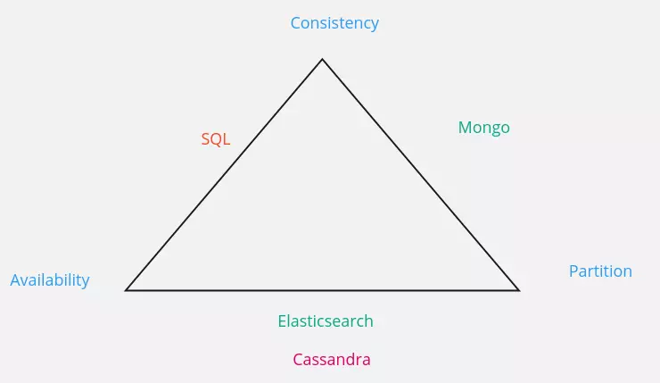

# Consistence

## Propriété ACID

- *Atomicité* : une écriture se fait totalement ou pas du tout
- *Cohérence* : toute écriture amène le système dans un état valide.
- *Isolation* : les transactions s'executent comme si elles étaient seules sur la base
- *Durabilité* : si une écriture est acquitée, elle est durable (elle restera même en cas de redémarrage ou de panne)

### Théorème CAP

## Propriété BASE

- **Basic available** la cohérence est maintenue autant que possible, mais pas garantie
- **Soft-state** après un certain temps, il n'y a qu'une probabilité que le système soit cohérent
- **Eventualle consistent** à terme le système deviendra cohérent
