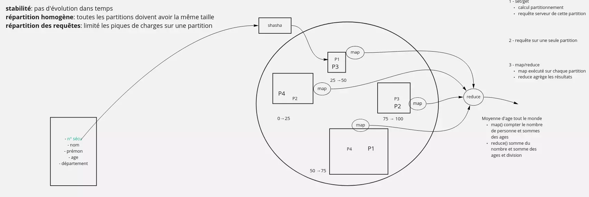
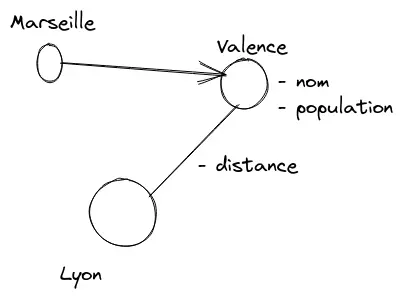

# NoSQL

## Problématique

Historiquement on utilise les SGBDR qui ont les propriétés ACID :
- *Atomicité* : on peut effectuer des actions en mode « tout ou rien ». C'est les transactions : si une transaction échoue, on _rollback_ ce qui avait déjà était modifié.
- *Cohérence* : l'état de la base de données est cohérent. Quelque soit la manière d'effectuer une requête à un instant donné le résultat sera identique.
- *Isolation* : chaque requête s'exécute comme si elle était seule sur le système. C'est aussi matérialisé par les transactions, mais aussi les niveaux d'isolation.
- *Durabilité* : après commit la données est stockée sur disque

Ces propriété posent des problèmes de montée en charge. En effet elles demandent à la fois que l'état complet des données soit maitrisé au moment de l'exécution d'une requête, et en plus elles demandent de sérialiser les requêtes pour garantir un état cohérent quelque soit le point de la base de données que l'on regarde. C'est problématique quand cet état ne peux plus entrer dans la mémoire vive d'un serveur. Dis autrement :

- il est impossible de garantir l'état global si les données impactée par une requête ne rentrent plus dans la mémoire du serveur qui exécute la requête ;
- il est impossible d'effectuer des écritures parallèles donc d'avoir plusieurs serveurs en écritures.

Google est le premier a avoir à la fois rencontré le problème, investi pour le contourner et publié ses travaux. Leurs objectifs sont simples. Ils ne peuvent plus faire grossir leurs serveurs de bases de données, ils ne veulent pas investir dans des mainframes, mais veulent utiliser du _commodity hardware_.

## Partitionnement

La solution trouvée par Google est simple : « diviser pour mieux régner ». On va séparer les données en partition. Un serveur physique pourra être responsable d'une ou plusieurs partition, mais les partitions restent de taille acceptable.

Pour une donnée que l'on souhaite stocker (l'équivalent d'une ligne de SGBDR), on va utiliser une clef de partitionnement. Cette dernière indiquera la partition où doit être stockée la donnée. Cette clef de partitionnement doit avoir 2 propriétés fondamentales :
- stabilité : la partition ne doit pas changer au cours du temps pour une même données. En effet il faut pouvoir retrouver la partition de l'ancienne version de la données si elle était présente.
- répartition homogène : il est important que la répartition entre les différentes partitions soient homogènes.

Chaque partition est indépendante. Il ne faut pas qu'une règle de gestion s'applique à un ensemble de partitions.

Le comportement que l'on cherche à maximiser :
- lors des lectures → requêter une seule partition
- lors des écritures → chaque écriture s'exécute sur une partition différentes pour utiliser tous les serveurs de notre base de données




## Map/Reduce

Lorsque l'on utilise du partitionnement il n'y a pas de difficulté à faire les calculs que l'on souhaite tant que l'on reste au sein d'une seule partition. Par contre il arrive de devoir travailler sur l'ensemble des données de la base. Pour cela on utilise Map/Reduce.

2 étapes :

1. on calcul pour chaque données de la base (vue comme un couple key/value la key est l'identifiant de la donnée et la value et l'ensemble) un ensemble de couple key/value (ça peut être un ensemble vide, un seul élément ou plusieurs). Les types de la clef et de la valeurs ne sont pas dépendant des types en entrée. Ce calcul 
2. on fourni ces ensembles de key/value à une fonction reduce. Pour chaque key différente, on execute la fonction reduce avec la clef et un itérateur sur l'ensemble des valeurs


```python
def map(key: K1, value: V1): -> list[tuple[K, V]]
    """
    Effectue un calcul local pour chaque donnée de la base
    @param key   id de la donnée en base
    @param value donnée de la base (peut être un objet complex, une row,…)
    @return ensemble de key/value
    """

def reduce(key: K, values: Generator[V]): -> typle[K2, R]
    """
    Effectue le calcul du résultat à partir de l'ensemble des résultats de l'étape map()
    @param key 
    @param values itérateur sur l'ensemble des données resultant du map()
    """
```

**Attention**

Attention les calculs organisés en `map`/`reduce` doivent être organisés avec précaution. Par exemple on essaiera de n'effectuer des divisions qu'au dernier moments.

**Exemple**

Données :

| id | Région | Nom | Population | Superficie (km2) |
|---|---|---|---|---|
| 1 | Ile de France | Paris | 2 165 423 | 105,40 |
| 2 | Auvergne-Rhone-Alpes | Lyon | 522 969 | 47,87 |
| 3 | Occitanie | Montpellier | 295 542 | 56,88 |

On cherche la densité moyenne des grandes villes par région. Résultat attendu :

| Région | Densité moyenne des villes |
|---|---|
| PACA | 5000 hab/km2 |
| Corse | 2000 hab/km2 |

_Étapes_

_Map_ pour chaque ville on va recevoir l'id et la raw. On va retourner pour chaque ville un couple Région → (Population, Superficie).

_Reduce_ sera executé pour chaque région et va recevoir en paramètre :

- la région
- un itérateur sur les couples population / superficie

et va à chaque fois retourner un couple région / dénsité moyenne

## Type de base de données NoSQL

### Document

La plus répandu est mongo. Leur principal caractéristique est de ne pas avoir de schema.

### Orienté colonne

Le principe est de ne pas stocker les données en ligne, mais en colonne.
Ainsi on a un stockage par type (on va stocker des entiers ensemble, des textes ensemble etc).
De plus les requêtes qui ne récupèrent pas une colonne ne manipule à aucun moment les colonnes non utilisées.

### clef-valeur

Souvent ses base de données sont en mémoire uniquement.
Elle servent souvent de cache, mais peuvent aussi servir de base de données principales.
Elles s'utilisent aussi simplement qu'on l'imagine.

### Graph

Permet d'utiliser des algo de graph directement dans la base.



### Timeseries

Sert à stocker des données temporelles.
Très efficace en insertion et permet de faire des requêtes continues (qui retourne toutes les données au fure et à mesure).
